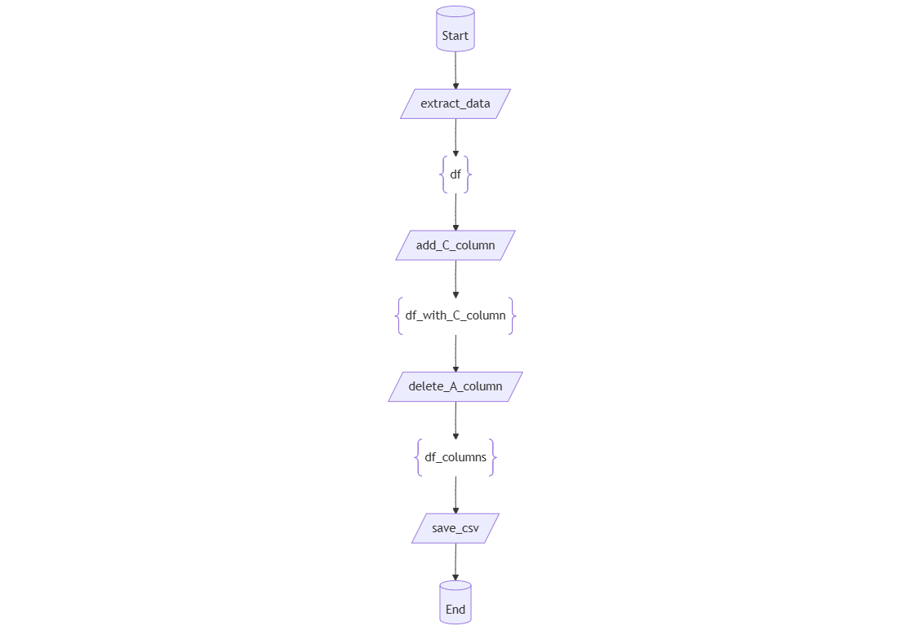

Decodoc
-------

.. note::
    This documentation is still under development. If you find any bug or have any suggestion in the decodoc module, please, open an issue in the `GitHub repository <https://github.com/baobabsoluciones/mango>`_.

The decodoc module is a powerful and versatile Python tool designed to facilitate advanced function logging, metadata
generation, and execution tracking. It automates the collection of detailed information about functions, including their
inputs, outputs, and execution context, while also supporting visualization and documentation workflows.

This tool is particularly valuable in complex applications where understanding the relationships between function calls,
debugging, or generating insightful documentation is crucial. With features like Mermaid diagram generation and JSON
metadata export, decodoc helps bridge the gap between code execution and documentation, ensuring traceability and
clarity throughout the development process.

Key Features:

- Function Execution Metadata Logging: Tracks function names, input values, output values, caller functions, and even the source code.

- Customizable Metadata Storage: Stores metadata in a global dictionary (INFO_DICT) for later use in debugging, analysis, and documentation.

- Support for Mermaid Diagrams: Generates visual diagrams of function call relationships for enhanced clarity.

- JSON and Prompt Outputs: Enables structured and customizable output for automated documentation pipelines.

- Flexible Setup Options: Allows developers to customize settings such as output formats, directory paths, and confidentiality preferences.

Decodoc will automatically three types of files:

- A JSON file containing all the metadata for each function call.

- A Mermaid diagram in a markdown file for each caller function plus a complete diagram of all functions.

- A prompt in a markdown file for each caller function plus.

Inner information dictionary and output JSON file
=========

The inner dictionary used for storing the metadata is called INFO_DICT. This dictionary is used to store the metadata collected during the execution of the functions. The INFO_DICT dictionary is structured as follows (with one entry per function call) and the JSON file containing this dictionary is automatically generated at the end of the execution:

.. code-block:: json
   :linenos:

   {
       "function id": {
           "name": "sample function",
           "caller": "caller function",
           "docstring": "docstring of the function",
           "code": "source code of the function",
           "input": {
               "input variable": {
                     "memory": "variable memory address",
                     "value": "variable value"
               }
           },
           "output": {
                "output variable": {
                        "memory": "variable memory address",
                        "value": "variable value"
                }
           }
       },
   }

Mermaid diagram generation
==================

The Mermaid diagram is a visual representation of the function call relationships. It is generated in a markdown file for each caller function and a complete diagram of all functions. The diagram is generated using the Mermaid library, which is a simple markdown-like script language for generating diagrams from text.

The different caller function refer to functions which are called by other functions. One diagram is generated for each caller function, showing the function and its direct children. The complete diagram shows all the functions and their relationships.

Example usage
==============

.. code-block:: python
   :linenos:

   import pandas as pd
   from mango.decodoc import decodoc

   @decodoc(["Start"], ["input_df_copy"])
   def extract_data():
       extracted_df = pd.DataFrame({"A": [1, 2, 3], "B": [4, 5, 6]})
       return extracted_df

   @decodoc(["df"], ["df_with_C_column"])
   def add_C_column(df):
       df["C"] = df["A"] + df["B"]
       return df.copy()

   @decodoc(["df_with_C_column"], ["df_columns"])
   def delete_A_column(df):
       del df["A"]
       return df.copy()

   @decodoc(["input_df_copy"], ["df_columns"])
   def handle_columns(df):
       df = add_C_column(df)
       df = delete_A_column(df)
       return df

   @decodoc(["df_columns"], ["End"])
   def save_csv(input_df):
       pass

   @decodoc(["Start"], ["End"])
   def main():
       df = extract_data()
       df = handle_columns(df)
       save_csv(df)

   if __name__ == '__main__':
       main()

In this script we have three different calling functions:

- module: calling the main function.

- main: calling extract_data, handle_columns and save_csv.

- handle_columns: calling add_C_column and delete_A_column.

The complete diagram will show all the functions and their relationships.

The Mermaid diagram for each of these functions will show the function and its direct children.

- module

- main

.. image:: ../static/img/main.png
   :alt: Alternate text for the image
   :width: 800
   :align: center

- handle_columns

.. image:: ../static/img/handle_columns.png
   :alt: Alternate text for the image
   :width: 800
   :align: center

Memory address issue
==================
.. caution:: Please pay close attention to the following warning to prevent errors in the decodoc implementation.

An issue to take into account is the use of memory addresses in the INFO_DICT dictionary. These are used for identifying the reuse of functions and to keep track of the use of the same variable across different functions.

An issue that arises with this is the use of single lines of code (not functions) that change the memory position of a variable. For example, the following code:

.. code-block:: python
   :linenos:

   @decodoc(["df"], ["df_with_C_column"])
   def add_C_column(df):
       df["C"] = df["A"] + df["B"]
       return df.copy()

   @decodoc(["df_with_C_column"], ["df_columns"])
   def delete_A_column(df):
       del df["A"]
       return df.copy()

   @decodoc(["input_df_copy"], ["df_columns"])
   def handle_columns(df):
       df_with_C_column = add_C_column(df)

       # This line changes the memory address of df_with_C_column
       df_with_C_column_copy = df_with_C_column.copy()

       df_columns = delete_A_column(df_with_C_column_copy)
       return df_columns

In this script the function delete_A_column will get a variable that has been seen before and will not be able to trace back to the function add_C_column. This is because the memory address of df_with_C_column has changed in the line df_with_C_column_copy = df_with_C_column.copy().

To avoid this issue, the user should avoid changing the memory address of a variable in a single line of code. Instead, the user should create a new function that changes the memory address of the variable and call this function in the main function, as shown in the following example:

.. code-block:: python
   :linenos:

   @decodoc(["df"], ["df_with_C_column"])
   def add_C_column(df):
       df["C"] = df["A"] + df["B"]
       return df.copy()

   @decodoc(["df_with_C_column"], ["df_columns"])
   def delete_A_column(df):
       del df["A"]
       return df.copy()

   @decodoc(["input_df_copy"], ["df_columns"])
   def handle_columns(df):
       df_with_C_column = add_C_column(df)

       @decodoc(["df_with_C_column"], ["df_with_C_column_copy"])
       def copy_df(df_with_C_column):
           return df_with_C_column.copy()
       df_with_C_column_copy = copy_df_with_C_column(df_with_C_column)

       df_columns = delete_A_column(df_with_C_column_copy)
       return df_columns

Another option will be to simply not log the functions inside of handle_columns, as shown in the following example:

.. code-block:: python
   :linenos:

   def add_C_column(df):
       df["C"] = df["A"] + df["B"]
       return df.copy()

   def delete_A_column(df):
       del df["A"]
       return df.copy()

   @decodoc(["input_df_copy"], ["df_columns"])
   def handle_columns(df):
       df_with_C_column = add_C_column(df)
       df_with_C_column_copy = df_with_C_column.copy()
       df_columns = delete_A_column(df_with_C_column_copy)
       return df_columns

In this case, the functions add_C_column and delete_A_column will not be logged and the memory address issue will be avoided.

Code documentation
==================

.. automodule:: mango.mango.decodoc.decodoc

