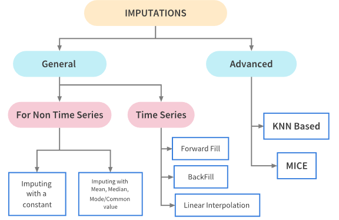

Processing
-----------

The processing module is a collection of tools aimed at processing data:

- `Date functions`_: functions to handle dates
- `File functions`_: functions to handle files
- `Object functions`_: functions to handle objects
- `Data Imputer`_: imputes missing values

Date functions
~~~~~~~~~~~~~~
.. automodule:: mango.processing.date_functions

File functions
~~~~~~~~~~~~~~
.. automodule:: mango.processing.file_functions

Object functions
~~~~~~~~~~~~~~
.. automodule:: mango.processing.object_functions

Data Imputer
~~~~~~~~~~~~~~

Imputation refers to replacing missing data with substituted values. The ``DataImputer`` class provides several methods to impute missing values depending on the nature of the problem and data:

**Statistical Imputation**

- **Mean Imputation**: Replaces missing values with the mean of the column.
  
  .. code-block:: python
  
      imputer = DataImputer(strategy="mean")
      imputed_df = imputer.apply_imputation(df)

  *Uses* ``sklearn.impute.SimpleImputer``

- **Median Imputation**: Replaces missing values with the median of the column.
  
  .. code-block:: python
  
      imputer = DataImputer(strategy="median")
      imputed_df = imputer.apply_imputation(df)

  *Uses* ``sklearn.impute.SimpleImputer``

- **Mode Imputation**: Replaces missing values with the most frequent value in the column.
  
  .. code-block:: python
  
      imputer = DataImputer(strategy="most_frequent")
      imputed_df = imputer.apply_imputation(df)

  *Uses* ``sklearn.impute.SimpleImputer``

**Machine Learning Based Imputation**

- **KNN Imputation**: Uses K-Nearest Neighbors algorithm to impute missing values based on similarity.
  
  .. code-block:: python
  
      imputer = DataImputer(strategy="knn", k_neighbors=5)
      imputed_df = imputer.apply_imputation(df)

  *Uses* ``sklearn.impute.KNNImputer``

- **Regression Imputation**: Uses regression models (Ridge, Lasso, or Linear Regression) to predict missing values.
  
  .. code-block:: python
  
      imputer = DataImputer(strategy="regression", regression_model="ridge")
      imputed_df = imputer.apply_imputation(df)

  *Uses* ``sklearn.linear_model`` *(Ridge, Lasso, LinearRegression)*

- **MICE (Multiple Imputation by Chained Equations)**: An iterative approach where each feature with missing values is modeled as a function of other features.
  
  .. code-block:: python
  
      imputer = DataImputer(strategy="mice")
      imputed_df = imputer.apply_imputation(df)

  *Uses* ``sklearn.impute.IterativeImputer`` *(requires* ``sklearn.experimental.enable_iterative_imputer`` *)*

**Time Series Imputation**

- **Forward Fill**: Propagates the last valid observation forward.
  
  .. code-block:: python
  
      imputer = DataImputer(strategy="forward")
      imputed_df = imputer.apply_imputation(df)

- **Backward Fill**: Uses the next valid observation to fill the gap.
  
  .. code-block:: python
  
      imputer = DataImputer(strategy="backward")
      imputed_df = imputer.apply_imputation(df)

- **Interpolation**: Uses various interpolation methods (linear, polynomial, etc.) to estimate missing values.
  
  .. code-block:: python
  
      imputer = DataImputer(strategy="interpolate", time_series_strategy="linear")
      imputed_df = imputer.apply_imputation(df)

  *Uses* ``pandas`` *for time series operations*

**Arbitrary Value Imputation**

- **Constant Value**: Replaces missing values with a specified arbitrary value.
  
  .. code-block:: python
  
      imputer = DataImputer(strategy="arbitrary", arbitrary_value=0)
      imputed_df = imputer.apply_imputation(df)

  *Uses* ``sklearn.impute.SimpleImputer``

**Column-Wise Imputation**

The ``DataImputer`` also supports applying different imputation strategies to different columns:

.. code-block:: python

    imputer = DataImputer(column_strategies={"column1": "mean", "column2": "knn"}, k_neighbors=3)
    imputed_df = imputer.apply_imputation(df)

**Library Dependencies**

The ``DataImputer`` class relies on several libraries to implement its imputation methods:

- **scikit-learn**:
      - ``sklearn.impute.SimpleImputer``: For mean, median, most frequent, and constant value imputation
      - ``sklearn.impute.KNNImputer``: For KNN-based imputation
      - ``sklearn.impute.IterativeImputer``: For MICE imputation (requires ``sklearn.experimental.enable_iterative_imputer``)
      - ``sklearn.linear_model``: For regression-based imputation (Ridge, Lasso, LinearRegression)

- **pandas**: For time series imputation methods (forward fill, backward fill, interpolation) and data manipulation

- **numpy**: For array operations and data conversion

- **polars**: For supporting polars DataFrames as input and output

.. autoclass:: mango.processing.data_imputer.DataImputer
