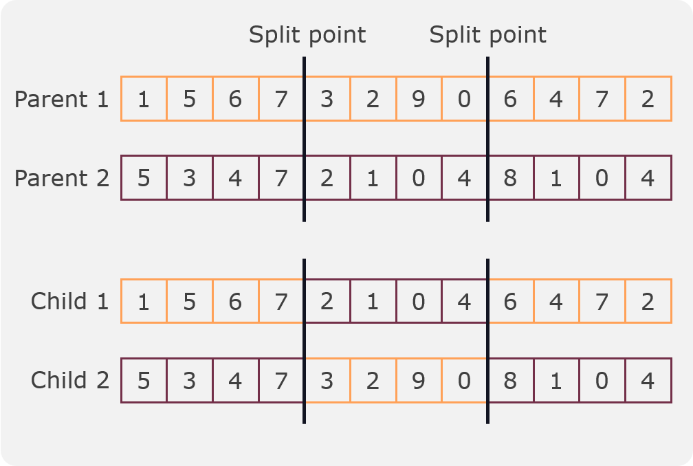

.. _crossover-label:

Crossover
----------

At its core, crossover emulates the biological concept of genetic recombination, where genetic material is exchanged between parent organisms to create offspring with a combination of traits from both parents. In the context of genetic algorithms (GA), crossover involves the recombination of genetic information encoded within individuals, typically represented as arrays of values.

The process begins by selecting pairs of individuals, often called parents, from the population based on their fitness – a measure of how well they perform in solving the given problem. Crossover then takes place, and specific segments of the parent chromosomes are exchanged, giving rise to new individuals known as offspring. The objective is to introduce diversity and potentially create solutions that inherit beneficial characteristics from both parents.

There are various crossover techniques employed in genetic algorithms, each with its own advantages and drawbacks. One-point crossover, two-point crossover, and uniform crossover are some common methods used to determine how genetic material is exchanged between parents. The choice of crossover method can significantly impact the algorithm's ability to explore the solution space effectively.

Crossover in genetic algorithms promotes the exploration of the solution space by combining different traits from parent individuals. This exploration mechanism allows the algorithm to move towards promising regions of the solution space, potentially converging to optimal or near-optimal solutions. However, the effectiveness of crossover is intertwined with other genetic operators like mutation, as well as parameters such as population size and selection mechanisms.

In conclusion, crossover is a fundamental component of genetic algorithms, playing a pivotal role in their ability to evolve solutions to complex problems. Its mimicry of biological recombination enables the algorithm to efficiently explore the solution space and discover novel, potentially superior solutions by combining the genetic information of parent individuals. The careful selection and tuning of crossover methods are essential for the success of genetic algorithms in finding optimal solutions in diverse application domains.

Crossover processes
===================

In mango there is several crossover processes implemented that can be used for the different types of encodings that the :class:`Individual<mango.models.genetic.individual.Individual>` class supports.

One-split crossover
~~~~~~~~~~~~~~~~~~~

In this crossover a split point is randomly selected and two children are created from two parents. The first child is created by taking the first part of the first parent and the second part of the second parent. The second child is created by taking the first part of the second parent and the second part of the first parent. An example can be seen in the following figure:

.. image:: ../static/img/one_split.png
    :width: 400
    :align: center

.. tip::
    This crossover can be used for all types of encodings.

This crossover process is implemented in the method: :meth:`one_split_crossover<mango.models.genetic.population.Population._one_split_crossover>`

Two-split crossover
~~~~~~~~~~~~~~~~~~~

In this crossover two split points are randomly selected and two children are created from two parents. The first child is created by taking the first part of the first parent, the second part of the second parent and the third part of the first parent. The second child is created by taking the first part of the second parent, the second part of the first parent and the third part of the second parent. An example can be seen in the following figure:

.. tip::
    This crossover can be used for all types of encodings.

This crossover process is implemented in the method: :meth:`two_split_crossover<mango.models.genetic.population.Population._two_split_crossover>`

Mask crossover
~~~~~~~~~~~~~~

In this crossover a mask is randomly generated and two children are created from two parents. The first child is created by taking the values of the first parent where the mask is 1 and the values of the second parent where the mask is 0. The second child is created by taking the values of the second parent where the mask is 1 and the values of the first parent where the mask is 0. An example can be seen in the following figure:

.. tip::
    This crossover can be used for all types of encodings.

This crossover process is implemented in the method: :meth:`mask_crossover<mango.models.genetic.population.Population._mask_crossover>`

Linear crossover
~~~~~~~~~~~~~~~~

asdasd

Flat crossover
~~~~~~~~~~~~~~

asdasd

Blend crossover
~~~~~~~~~~~~~~~

adsasd

Gaussian crossover
~~~~~~~~~~~~~~~~~~

asdasd

Morphology crossover
~~~~~~~~~~~~~~~~~~~~

asdasd